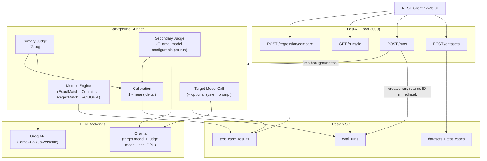
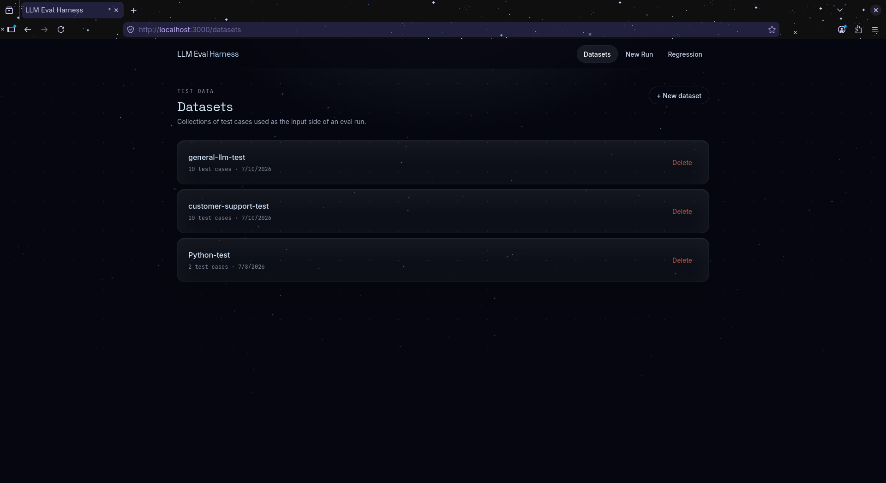
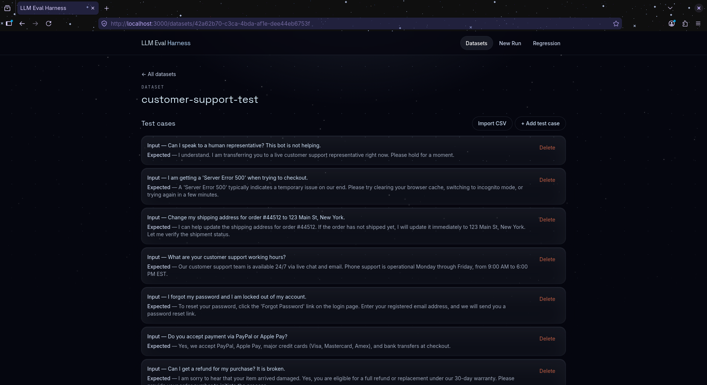
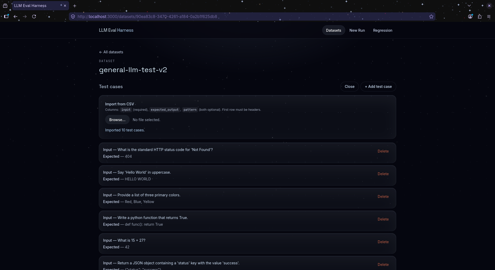
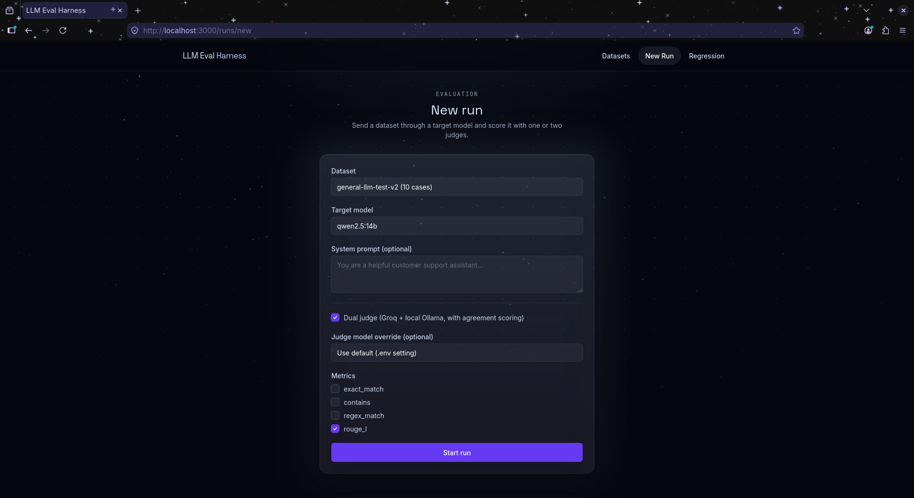
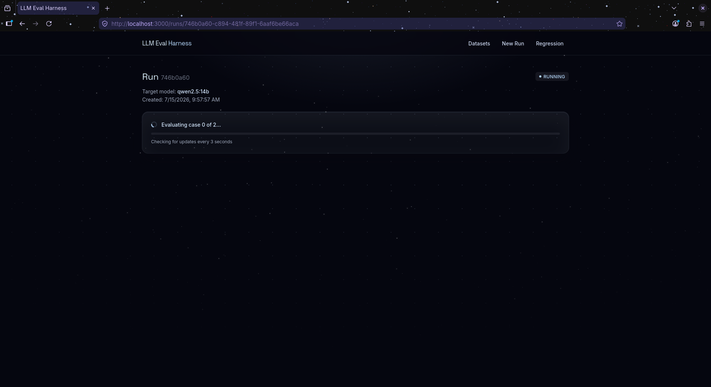
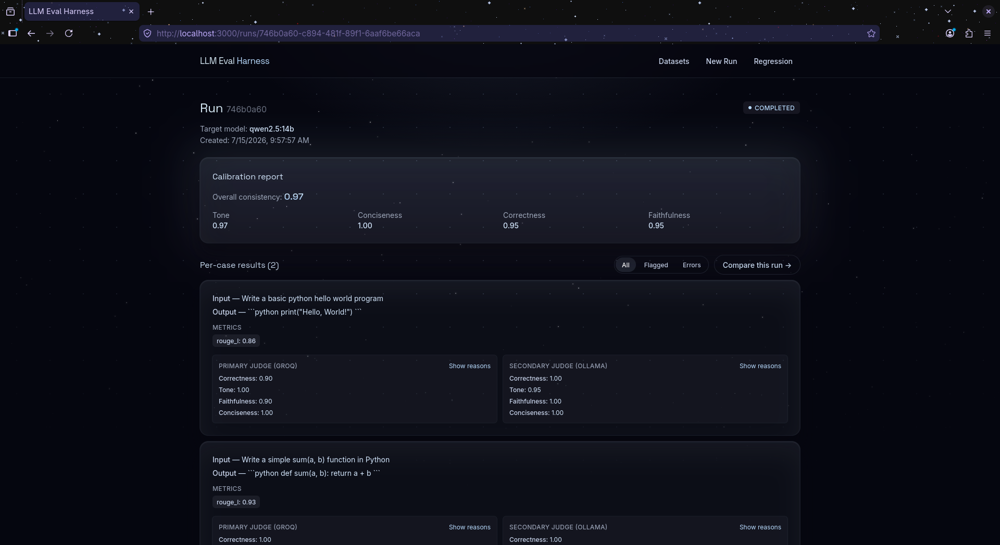
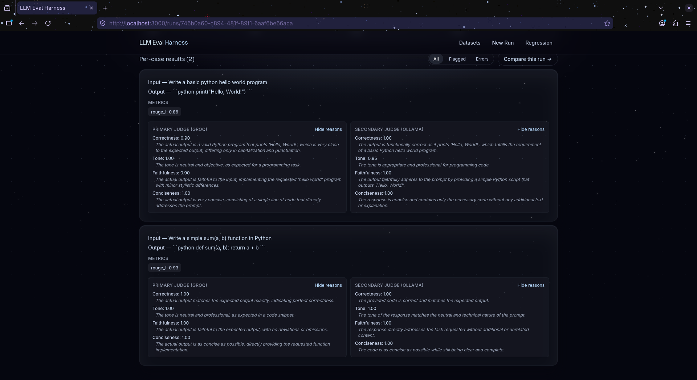
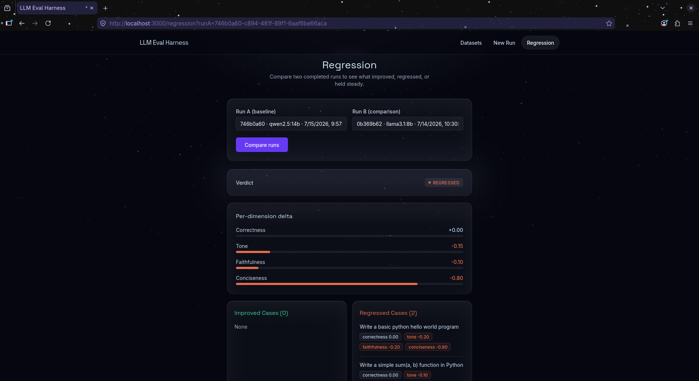

# LLM Evaluation Harness

An API-first LLM evaluation framework for systematic, reproducible scoring of LLM outputs across multiple quality dimensions — with regression tracking to detect what changed between runs.

Built with FastAPI, async PostgreSQL, and a dual-judge architecture (Groq + Ollama), with a full React frontend covering the entire workflow. Every capability is also available directly via REST API and OpenAPI docs.

---

## Why This Exists

Most LLM evaluation workflows look like: change the prompt, eyeball 5 responses, deploy and hope. This system replaces that with:

- **Structured scoring** across four dimensions: correctness, tone, faithfulness, conciseness
- **Dual-judge calibration** — Groq (cloud) and Ollama (local) score independently; disagreement flags low-confidence cases
- **Regression tracking** — diff any two runs on the same dataset, get a per-dimension delta report and a verdict (`improved | regressed | mixed | neutral`)
- **Pluggable metrics** — deterministic metrics (exact match, ROUGE-L, contains, regex) + LLM-as-judge, both behind the same interface
- **System prompt support** — evaluate the model configured the way you'd actually deploy it, not a raw base model with no instructions

The model being evaluated (the **target model**) is whatever you point it at — a base model, your own fine-tune, a LoRA merge, anything registered locally in Ollama. The two judges (Groq and a local Ollama model) stay fixed across runs so every target model is scored on the same rubric, which is what makes runs comparable over time.

---

## Architecture



The target model under evaluation always runs locally via Ollama. Groq and the local judge model are judge-only — they score the target model's output, they are never themselves the model being tested.

---

## Stack

| Layer | Technology |
|---|---|
| API framework | FastAPI |
| Database | PostgreSQL (async via SQLAlchemy + asyncpg) |
| Migrations | Alembic |
| Frontend | React + Vite + Tailwind CSS |
| CSV import | Papa Parse |
| Primary judge | Groq API (`llama-3.3-70b-versatile`) |
| Secondary judge | Ollama (default `llama3.1:8b`, overridable per-run, local GPU) |
| HTTP client | httpx (async) |
| Metrics | rouge-score + custom implementations |
| Logging | Loguru |
| Testing | pytest + pytest-asyncio |
| Containerization | Docker Compose |

---

## Quickstart

### Prerequisites

- Docker + Docker Compose
- Node.js 18+ (for running the UI in development)
- NVIDIA GPU with drivers installed (for local Ollama judge and target model inference)
- Groq API key — free tier at [console.groq.com](https://console.groq.com)

### 1. Clone and configure

```bash
git clone https://github.com/hassan-ahmed/llm-eval-harness.git
cd llm-eval-harness
```

Edit `.env` and set at minimum:
```bash
POSTGRES_PASSWORD=yourpassword
GROQ_API_KEY=your_groq_api_key_here
```

### 2. Start the backend stack

```bash
docker compose up --build
```

This starts three services: `db` (PostgreSQL), `ollama`, and `api` (FastAPI on port 8000).

### 3. Run migrations

```bash
docker compose exec api alembic upgrade head
```

### 4. Pull models into Ollama

At minimum, pull the default judge model:
```bash
docker compose exec ollama ollama pull llama3.1:8b
```

Also pull whichever model(s) you want to evaluate as a **target model** — see [Adding Models to Ollama](#adding-models-to-ollama) below for full detail, including how to register your own fine-tunes.

### 5. Start the UI (development mode)

```bash
cd ui
npm install
npm run dev
```

Open `http://localhost:3000`. The dev server proxies API calls to `localhost:8000` automatically.

### 6. Verify the API directly (optional)

```bash
curl http://localhost:8000/docs
```

OpenAPI docs should load. The system is ready.

---

## Adding Models to Ollama

Every model dropdown in the UI — Target Model and the judge model override — reflects exactly what `ollama list` shows on your machine. There is no separate registration step in this app; if Ollama knows about a model, the UI does too.

### Pulling an official model

```bash
docker compose exec ollama ollama pull <model-tag>
```

Browse available tags at [ollama.com/library](https://ollama.com/library). Examples:
```bash
docker compose exec ollama ollama pull mistral:7b
docker compose exec ollama ollama pull qwen2.5:14b
docker compose exec ollama ollama pull phi3
```

Check VRAM against your GPU before pulling a large model — a 12GB card comfortably handles up to ~14B models; going larger risks slow swapping or out-of-memory errors, especially if the target model and judge model need to be loaded at once.

### Registering your own fine-tune or custom model

If you've fine-tuned a model (full fine-tune, LoRA merge, or otherwise produced custom weights in GGUF format), register it with Ollama using a `Modelfile`:

```bash
# on your host machine, in a folder with your GGUF file
cat > Modelfile << 'EOF'
FROM ./your-model.gguf
EOF

docker compose cp Modelfile ollama:/tmp/Modelfile
docker compose cp your-model.gguf ollama:/tmp/your-model.gguf
docker compose exec ollama ollama create my-finetune -f /tmp/Modelfile
```

Once created, `my-finetune` appears in `ollama list` — and therefore in every model dropdown in the UI — exactly like an official model. No code changes are needed on either the frontend or backend to evaluate a custom model; the app was built to reflect Ollama's local state faithfully rather than maintain its own separate model registry.

### Verifying what's available

```bash
docker compose exec ollama ollama list
```

### A note on judges vs. target models

Groq and the local judge model are fixed roles — they score output, they are never themselves evaluated. Only the **target model** field changes between runs. This means you can pull or register as many target models as you want and compare them all against the same two judges, which is what makes scores comparable across runs and over time.

---

## UI Walkthrough

The UI covers the full workflow — no need to touch curl for day-to-day use. Four screens, reachable from the top navbar.

### Datasets

Create datasets, add test cases individually or in bulk via CSV import, and browse existing test cases per dataset.

- **CSV import** accepts a file with `input` (required), `expected_output` (optional), and `pattern` (optional, used by the `regex_match` metric) columns. Invalid rows are skipped and reported, not silently dropped.
- Each test case can optionally include a regex `pattern` in its metadata for use with the `regex_match` metric.





### New Run

Configure and launch an evaluation:

- **Dataset** — any existing dataset, shown with its test case count
- **Target model** — any model available in your local Ollama instance (see [Adding Models to Ollama](#adding-models-to-ollama))
- **System prompt** (optional) — evaluates the model as it would actually be deployed, with real instructions, rather than a bare base model with no configuration
- **Dual judge toggle** — on by default; when on, both Groq and a local Ollama model score every case independently
- **Judge model override** (optional) — pick a different local model than the `.env` default for the secondary judge, without restarting anything
- **Metrics** — any combination of `exact_match`, `contains`, `regex_match`, `rouge_l`

Submitting redirects immediately to the Run Results screen for that run.



### Run Results

Live-polls the backend every 3 seconds while a run is in progress.

- **Real progress indicator** — shows exactly how many test cases have been scored so far out of the total, not just a generic spinner
- **Calibration report** — per-dimension agreement between the two judges, plus an overall consistency score, once the run completes
- **Per-case results** — input, output, deterministic metric scores, and both judges' dimension scores side by side
- **Judge reasoning toggle** — each judge block has a "Show reasons" toggle to reveal the natural-language justification behind each dimension score, independently for primary and secondary judge — useful for understanding *why* two judges disagree, not just that they did
- **Low-confidence flag** — highlighted whenever the two judges disagree beyond `JUDGE_DISAGREEMENT_THRESHOLD` on any dimension





### Regression

Compare any two completed runs on the same dataset:

- Pick Run A (baseline) and Run B (comparison) from dropdowns of completed runs
- **Verdict badge** — `improved` / `regressed` / `mixed` / `neutral`, color-coded
- **Per-dimension delta bars** — visual, sign-colored comparison across all four judge dimensions
- **Improved/regressed case lists** — which specific test cases moved in which direction

Reachable directly, or via "Compare this run" from any completed Run Results page.



---

## Example Workflow (via API)

The UI covers the full workflow, but everything is also available directly via REST.

### Create a dataset

```bash
curl -s -X POST http://localhost:8000/datasets \
  -H "Content-Type: application/json" \
  -d '{"name": "customer-support-v1", "description": "Billing and refund queries"}' \
  | python3 -m json.tool
```

### Add test cases

```bash
DATASET_ID="your-dataset-id-here"

curl -s -X POST http://localhost:8000/datasets/$DATASET_ID/test-cases \
  -H "Content-Type: application/json" \
  -d '{
    "input": "What is your refund policy?",
    "expected_output": "We offer a 30-day money-back guarantee on all purchases."
  }' | python3 -m json.tool
```

To use the `regex_match` metric on a test case, include a `pattern` in `metadata`:

```bash
curl -s -X POST http://localhost:8000/datasets/$DATASET_ID/test-cases \
  -H "Content-Type: application/json" \
  -d '{
    "input": "What year did the refund policy start?",
    "expected_output": null,
    "metadata": {"pattern": "\\d{4}"}
  }' | python3 -m json.tool
```

### List test cases in a dataset

```bash
curl -s http://localhost:8000/datasets/$DATASET_ID/test-cases | python3 -m json.tool
```

### Run an evaluation

```bash
curl -s -X POST http://localhost:8000/runs \
  -H "Content-Type: application/json" \
  -d "{
    \"dataset_id\": \"$DATASET_ID\",
    \"target_model\": \"llama3.1:8b\",
    \"system_prompt\": \"You are a helpful, concise customer support agent.\",
    \"judge_config\": {
      \"primary_backend\": \"groq\",
      \"secondary_backend\": \"ollama\",
      \"secondary_model\": \"qwen2.5:14b\",
      \"dual_judge\": true,
      \"metrics\": [\"exact_match\", \"rouge_l\"]
    }
  }" | python3 -m json.tool
```

`system_prompt` is optional — omit it or set it to `null` to evaluate the target model with no system message. `judge_config.secondary_model` is also optional — omit it to use the `OLLAMA_JUDGE_MODEL` default from `.env`.

Returns immediately with a run ID and `status: pending`.

### Poll for completion

```bash
RUN_ID="your-run-id-here"
watch -n 3 "curl -s http://localhost:8000/runs/$RUN_ID | python3 -m json.tool"
```

Status transitions: `pending → running → completed | failed`.

### List all runs

```bash
curl -s "http://localhost:8000/runs?status=completed" | python3 -m json.tool
```

### Inspect results

```bash
curl -s http://localhost:8000/runs/$RUN_ID/results | python3 -m json.tool
```

Example result object:
```json
{
    "test_case_id": "...",
    "actual_output": "We have a 30-day return policy for all items.",
    "metric_scores": {
        "exact_match": {"score": 0.0, "passed": false},
        "rouge_l": {"score": 0.61, "passed": null}
    },
    "primary_judge_score": {
        "correctness": {"score": 0.9, "reason": "Accurately conveys the 30-day policy"},
        "tone": {"score": 0.85, "reason": "Professional and clear"},
        "faithfulness": {"score": 0.8, "reason": "Slightly different phrasing but faithful"},
        "conciseness": {"score": 0.95, "reason": "Direct and to the point"}
    },
    "low_confidence": false,
    "error": null
}
```

### Compare two runs (regression tracking)

```bash
curl -s -X POST http://localhost:8000/regression/compare \
  -H "Content-Type: application/json" \
  -d "{\"run_a_id\": \"$RUN_A_ID\", \"run_b_id\": \"$RUN_B_ID\"}" \
  | python3 -m json.tool
```

Example regression report:
```json
{
    "per_dimension_avg_delta": {
        "correctness": 0.08,
        "tone": 0.22,
        "faithfulness": -0.05,
        "conciseness": -0.10
    },
    "regressed_cases": [],
    "improved_cases": ["case-id-1", "case-id-2"],
    "verdict": "improved",
    "calibration_report": {
        "dimension_agreement": {
            "correctness": 0.91,
            "tone": 0.87,
            "faithfulness": 0.83,
            "conciseness": 0.79
        },
        "overall_consistency": 0.85
    }
}
```

---

## API Reference

| Method | Endpoint | Description |
|---|---|---|
| `POST` | `/datasets` | Create a dataset |
| `GET` | `/datasets` | List datasets (filter by `?tag=`) — includes `test_case_count` per dataset |
| `GET` | `/datasets/{id}` | Get a dataset |
| `PATCH` | `/datasets/{id}` | Update a dataset |
| `DELETE` | `/datasets/{id}` | Delete a dataset |
| `POST` | `/datasets/{id}/test-cases` | Add a test case |
| `GET` | `/datasets/{id}/test-cases` | List all test cases in a dataset |
| `GET` | `/datasets/{id}/test-cases/{id}` | Get a single test case |
| `PATCH` | `/datasets/{id}/test-cases/{id}` | Update a test case |
| `DELETE` | `/datasets/{id}/test-cases/{id}` | Delete a test case |
| `POST` | `/runs` | Create an eval run (async); accepts optional `system_prompt` |
| `GET` | `/runs` | List runs (filter by `?status=` and/or `?dataset_id=`) |
| `GET` | `/runs/{id}` | Get run status + calibration report |
| `GET` | `/runs/{id}/results` | Get per-case results — also usable mid-run to compute live progress |
| `POST` | `/regression/compare` | Compare two runs |
| `GET` | `/backends/ollama/models` | List available Ollama models (includes any registered fine-tunes) |

Full interactive docs at `http://localhost:8000/docs`.

---

## Metrics

| Metric | Type | Description |
|---|---|---|
| `exact_match` | Deterministic | Case-sensitive string equality. Best suited to short factual answers — a poor fit for free-form text like code or prose, where near-identical output rarely matches byte-for-byte. |
| `contains` | Deterministic | Case-insensitive substring check |
| `regex_match` | Deterministic | Regex pattern match via `re.search`; requires a `pattern` key in the test case's `metadata` |
| `rouge_l` | Deterministic | F1 over longest common subsequence of tokens. On very short outputs, scores saturate toward 1.0 easily — treat as a weak signal for short answers, stronger for longer free-form text. |
| LLM Judge | LLM-as-judge | Four-dimension scoring: correctness, tone, faithfulness, conciseness, each with a natural-language reason |

Adding a new metric requires only implementing the `Metric` ABC and calling `register()` — no changes to the runner. Metrics that need extra per-case data (like `regex_match`'s `pattern`) read it from the test case's `metadata` field, which the runner forwards automatically as keyword arguments.

### A note on judge reliability

Smaller local judge models (e.g. 8B-class) are noticeably less reliable than larger models at consistently mapping a written justification onto the correct sign of a `-1.0`–`1.0` score — you may see a judge write a clearly positive justification and still emit a negative score, or vice versa. This is a known limitation of smaller models on structured numeric-scoring tasks, not a bug in the harness. Low `overall_consistency` in a calibration report is the system correctly flagging this, not a sign something is broken. If it's a persistent problem, try a larger secondary judge model via the per-run judge override (see [Adding Models to Ollama](#adding-models-to-ollama)).

---

## Judge Configuration

```json
{
  "primary_backend": "groq",
  "primary_model": "llama-3.3-70b-versatile",
  "secondary_backend": "ollama",
  "secondary_model": "llama3.1:8b",
  "dual_judge": true,
  "metrics": ["exact_match", "rouge_l"]
}
```

- `dual_judge: false` + `secondary_backend: null` — single judge mode, no calibration
- `dual_judge: true` — both judges score every case independently; agreement computed per dimension
- `secondary_model` — optional per-run override for the local judge model; omit to use the `OLLAMA_JUDGE_MODEL` default from `.env`. Exposed in the UI as "Judge model override" on the New Run screen.
- Cases where judges disagree by more than `JUDGE_DISAGREEMENT_THRESHOLD` (default `0.3`) are flagged `low_confidence: true`
- `target_model` and `system_prompt` are set on the run itself, not in `judge_config`. The target model is always executed via the local Ollama backend, regardless of which backends are configured as judges.

---

## Environment Variables

```bash
# Database
POSTGRES_PASSWORD=changeme
DATABASE_URL=postgresql+asyncpg://eval_user:changeme@db:5432/llm_eval

# Ollama
OLLAMA_BASE_URL=http://ollama:11434
OLLAMA_JUDGE_MODEL=llama3.1:8b

# Groq
GROQ_API_KEY=your_groq_api_key_here
GROQ_JUDGE_MODEL=llama-3.3-70b-versatile

# Application
LOG_LEVEL=INFO
LOG_FORMAT=human          # 'human' for dev, 'json' for prod
REGRESSION_THRESHOLD=0.1  # min score drop to flag a case as regressed
JUDGE_DISAGREEMENT_THRESHOLD=0.3
```

**Env vars are only read when the container starts.** After editing `.env`, run:
```bash
docker compose down
docker compose up --build
```
A plain `restart` is not always sufficient — `down` + `up` guarantees a clean re-read.

Groq periodically deprecates older model tags. If judge calls start failing with a 404, check [console.groq.com](https://console.groq.com) for currently supported models and update `GROQ_JUDGE_MODEL`.

---

## Running Tests

```bash
# Metrics and judge tests — no Docker needed
pytest tests/test_metrics.py tests/test_judge.py -v

# Dataset CRUD tests — requires Postgres
docker compose up -d db
pytest tests/test_datasets/ -v

# Full suite
docker compose up -d db
pytest -v
```

---

## Project Structure

```
llm-eval-harness/
├── app/
│   ├── main.py                         # app factory + lifespan + CORS
│   ├── core/
│   │   ├── config.py                   # pydantic-settings
│   │   ├── logging.py                  # Loguru
│   │   └── db.py                       # engine, session, get_db
│   ├── models/
│   │   ├── dataset.py                  # Dataset, TestCase ORM
│   │   └── run.py                      # EvalRun (incl. system_prompt), TestCaseResult ORM
│   ├── schemas/
│   │   ├── dataset.py                  # Dataset/TestCase Pydantic schemas
│   │   ├── run.py                      # EvalRun, JudgeConfig schemas
│   │   ├── judge.py                    # JudgeScore, DimensionScore
│   │   └── regression.py               # RegressionReport, TestCaseDelta
│   ├── api/
│   │   ├── datasets.py                 # Dataset + TestCase CRUD routes
│   │   ├── runs.py                     # Eval run routes
│   │   ├── backends.py                 # Backend info routes
│   │   └── regression.py               # Regression compare route
│   ├── backends/
│   │   ├── base.py                     # LLMBackend ABC
│   │   ├── ollama.py                   # Ollama client
│   │   └── groq.py                     # Groq client
│   ├── metrics/
│   │   ├── base.py                     # Metric ABC, MetricResult
│   │   ├── registry.py                 # name → instance registry
│   │   ├── implementations.py          # ExactMatch, Contains, RegexMatch, RougeL
│   │   └── judge.py                    # LLMJudge with retry + extraction
│   └── services/
│       ├── runner.py                   # async background eval loop — target model
│       │                               # always routed through Ollama regardless
│       │                               # of judge backend config
│       └── regression.py               # run comparison + verdict
├── ui/                                 # React + Vite + Tailwind frontend
│   ├── src/
│   │   ├── main.jsx                    # React root + router
│   │   ├── App.jsx                     # route definitions
│   │   ├── api.js                      # shared fetch client
│   │   ├── index.css
│   │   ├── components/
│   │   │   ├── Navbar.jsx
│   │   │   ├── Starfield.jsx
│   │   │   └── ui.jsx
│   │   └── pages/
│   │       ├── DatasetsPage.jsx        # list/detail, create/delete, CSV import
│   │       ├── NewRunPage.jsx          # dataset + target model + system prompt +
│   │       │                           # judge config + metrics form
│   │       ├── RunResultsPage.jsx      # live polling, real progress bar,
│   │       │                           # judge reasoning toggles
│   │       └── RegressionPage.jsx      # run comparison + verdict
│   ├── vite.config.js                  # dev server + /api proxy to :8000
│   ├── tailwind.config.js
│   ├── package.json
│   └── index.html
├── alembic/                            # async migrations
├── tests/
│   ├── test_metrics.py                 # deterministic metric unit tests
│   ├── test_judge.py                   # judge unit tests (mocked backends)
│   └── test_datasets/
│       ├── conftest.py                 # DB fixtures (scoped to this dir)
│       └── test_datasets.py            # dataset CRUD integration tests
├── Dockerfile
├── docker-compose.yml
├── pytest.ini
└── requirements.txt
```
