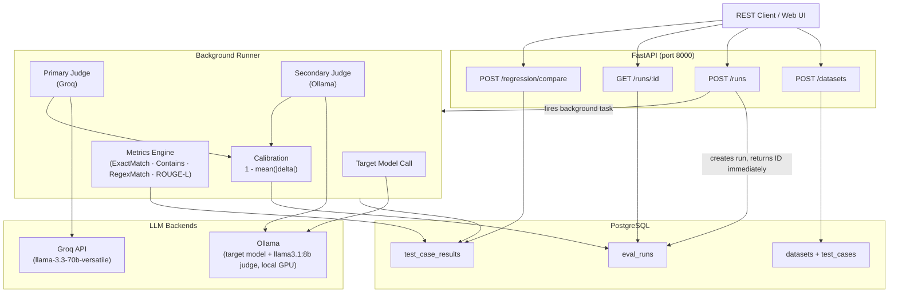

# LLL Evaluation Harness

An API-first LLM evaluation framework for systematic, reproducible scoring of LLM outputs across multiple quality dimensions — with regression tracking to detect what changed between runs.

Built with FastAPI, async PostgreSQL, and a dual-judge architecture (Groq + Ollama), with a React frontend for the full workflow. Every capability is also available directly via REST API and OpenAPI docs.

---

## Why This Exists

Most LLM evaluation workflows look like: change the prompt, eyeball 5 responses, deploy and hope. This system replaces that with:

- **Structured scoring** across four dimensions: correctness, tone, faithfulness, conciseness
- **Dual-judge calibration** — Groq (cloud) and Ollama (local) score independently; disagreement flags low-confidence cases
- **Regression tracking** — diff any two runs on the same dataset, get a per-dimension delta report and a verdict (`improved | regressed | mixed | neutral`)
- **Pluggable metrics** — deterministic metrics (exact match, ROUGE-L, contains, regex) + LLM-as-judge, both behind the same interface

The model being evaluated (the **target model**) is whatever you point it at — a base model, your own fine-tune, a LoRA merge, anything registered locally in Ollama. The two judges (Groq and a local Ollama model) stay fixed across runs so every target model is scored on the same rubric, which is what makes runs comparable over time.

---

## Architecture



The target model under evaluation always runs locally via Ollama. Groq and the local judge model are judge-only — they score the target model's output, they are never themselves the model being tested.

---

## Stack

| Layer | Technology |
|---|---|
| API framework | FastAPI |
| Database | PostgreSQL (async via SQLAlchemy + asyncpg) |
| Migrations | Alembic |
| Frontend | React + Vite + Tailwind CSS |
| Primary judge | Groq API (`llama-3.3-70b-versatile`) |
| Secondary judge | Ollama (`llama3.1:8b`, local GPU) |
| HTTP client | httpx (async) |
| Metrics | rouge-score + custom implementations |
| Logging | Loguru |
| Testing | pytest + pytest-asyncio |
| Containerization | Docker Compose |

---

## Quickstart

### Prerequisites

- Docker + Docker Compose
- Node.js 18+ (for running the UI in development)
- NVIDIA GPU with drivers installed (for local Ollama judge and target model inference)
- Groq API key — free tier at [console.groq.com](https://console.groq.com)

### 1. Clone and configure

```bash
git clone https://github.com/hassan-ahmed/llm-eval-harness.git
cd llm-eval-harness
```

Edit `.env` and set at minimum:
```bash
POSTGRES_PASSWORD=yourpassword
GROQ_API_KEY=your_groq_api_key_here
```

### 2. Start the backend stack

```bash
docker compose up --build
```

This starts three services: `db` (PostgreSQL), `ollama`, and `api` (FastAPI on port 8000).

### 3. Run migrations

```bash
docker compose exec api alembic upgrade head
```

### 4. Pull the local judge model

```bash
docker compose exec ollama ollama pull llama3.1:8b
```

Also pull whichever target model(s) you want to evaluate, e.g.:
```bash
docker compose exec ollama ollama pull llama3.1:8b
```
Any model registered in your local Ollama instance — including your own fine-tunes registered via `ollama create` — becomes selectable as a target model automatically. No backend or frontend change is needed to evaluate a custom model; the app reflects whatever Ollama already knows about.

### 5. Start the UI (development mode)

```bash
cd ui
npm install
npm run dev
```

Open `http://localhost:3000`. The dev server proxies API calls to `localhost:8000` automatically.

### 6. Verify the API directly (optional)

```bash
curl http://localhost:8000/docs
```

OpenAPI docs should load. The system is ready.

---

## Example Workflow (via UI)

1. **Datasets** — create a dataset, add test cases (input + expected output, and an optional regex pattern if you plan to use the `regex_match` metric).
2. **New Run** — pick the dataset, pick a target model from your local Ollama models, toggle dual judge on/off, select metrics, submit.
3. **Run Results** — polls automatically until the run completes; shows per-case metric scores, both judges' dimension scores, and a calibration report.
4. **Regression** — pick two completed runs on the same dataset to get a per-dimension delta report and a verdict.

---

## Example Workflow (via API)

### Create a dataset

```bash
curl -s -X POST http://localhost:8000/datasets \
  -H "Content-Type: application/json" \
  -d '{"name": "customer-support-v1", "description": "Billing and refund queries"}' \
  | python3 -m json.tool
```

### Add test cases

```bash
DATASET_ID="your-dataset-id-here"

curl -s -X POST http://localhost:8000/datasets/$DATASET_ID/test-cases \
  -H "Content-Type: application/json" \
  -d '{
    "input": "What is your refund policy?",
    "expected_output": "We offer a 30-day money-back guarantee on all purchases."
  }' | python3 -m json.tool
```

To use the `regex_match` metric on a test case, include a `pattern` in `metadata`:

```bash
curl -s -X POST http://localhost:8000/datasets/$DATASET_ID/test-cases \
  -H "Content-Type: application/json" \
  -d '{
    "input": "What year did the refund policy start?",
    "expected_output": null,
    "metadata": {"pattern": "\\d{4}"}
  }' | python3 -m json.tool
```

### List test cases in a dataset

```bash
curl -s http://localhost:8000/datasets/$DATASET_ID/test-cases | python3 -m json.tool
```

### Run an evaluation

```bash
curl -s -X POST http://localhost:8000/runs \
  -H "Content-Type: application/json" \
  -d "{
    \"dataset_id\": \"$DATASET_ID\",
    \"target_model\": \"llama3.1:8b\",
    \"judge_config\": {
      \"primary_backend\": \"groq\",
      \"secondary_backend\": \"ollama\",
      \"dual_judge\": true,
      \"metrics\": [\"exact_match\", \"rouge_l\"]
    }
  }" | python3 -m json.tool
```

Returns immediately with a run ID and `status: pending`.

### Poll for completion

```bash
RUN_ID="your-run-id-here"
watch -n 3 "curl -s http://localhost:8000/runs/$RUN_ID | python3 -m json.tool"
```

Status transitions: `pending → running → completed | failed`.

### List all runs

```bash
curl -s "http://localhost:8000/runs?status=completed" | python3 -m json.tool
```

### Inspect results

```bash
curl -s http://localhost:8000/runs/$RUN_ID/results | python3 -m json.tool
```

Example result object:
```json
{
    "test_case_id": "...",
    "actual_output": "We have a 30-day return policy for all items.",
    "metric_scores": {
        "exact_match": {"score": 0.0, "passed": false},
        "rouge_l": {"score": 0.61, "passed": null}
    },
    "primary_judge_score": {
        "correctness": {"score": 0.9, "reason": "Accurately conveys the 30-day policy"},
        "tone": {"score": 0.85, "reason": "Professional and clear"},
        "faithfulness": {"score": 0.8, "reason": "Slightly different phrasing but faithful"},
        "conciseness": {"score": 0.95, "reason": "Direct and to the point"}
    },
    "low_confidence": false,
    "error": null
}
```

### Compare two runs (regression tracking)

```bash
curl -s -X POST http://localhost:8000/regression/compare \
  -H "Content-Type: application/json" \
  -d "{\"run_a_id\": \"$RUN_A_ID\", \"run_b_id\": \"$RUN_B_ID\"}" \
  | python3 -m json.tool
```

Example regression report:
```json
{
    "per_dimension_avg_delta": {
        "correctness": 0.08,
        "tone": 0.22,
        "faithfulness": -0.05,
        "conciseness": -0.10
    },
    "regressed_cases": [],
    "improved_cases": ["case-id-1", "case-id-2"],
    "verdict": "improved",
    "calibration_report": {
        "dimension_agreement": {
            "correctness": 0.91,
            "tone": 0.87,
            "faithfulness": 0.83,
            "conciseness": 0.79
        },
        "overall_consistency": 0.85
    }
}
```

---

## API Reference

| Method | Endpoint | Description |
|---|---|---|
| `POST` | `/datasets` | Create a dataset |
| `GET` | `/datasets` | List datasets (filter by `?tag=`) — includes `test_case_count` per dataset |
| `GET` | `/datasets/{id}` | Get a dataset |
| `PATCH` | `/datasets/{id}` | Update a dataset |
| `DELETE` | `/datasets/{id}` | Delete a dataset |
| `POST` | `/datasets/{id}/test-cases` | Add a test case |
| `GET` | `/datasets/{id}/test-cases` | List all test cases in a dataset |
| `GET` | `/datasets/{id}/test-cases/{id}` | Get a single test case |
| `PATCH` | `/datasets/{id}/test-cases/{id}` | Update a test case |
| `DELETE` | `/datasets/{id}/test-cases/{id}` | Delete a test case |
| `POST` | `/runs` | Create an eval run (async) |
| `GET` | `/runs` | List runs (filter by `?status=` and/or `?dataset_id=`) |
| `GET` | `/runs/{id}` | Get run status + calibration report |
| `GET` | `/runs/{id}/results` | Get per-case results |
| `POST` | `/regression/compare` | Compare two runs |
| `GET` | `/backends/ollama/models` | List available Ollama models (includes any registered fine-tunes) |

Full interactive docs at `http://localhost:8000/docs`.

---

## Metrics

| Metric | Type | Description |
|---|---|---|
| `exact_match` | Deterministic | Case-sensitive string equality |
| `contains` | Deterministic | Case-insensitive substring check |
| `regex_match` | Deterministic | Regex pattern match via `re.search`; requires a `pattern` key in the test case's `metadata` |
| `rouge_l` | Deterministic | F1 over longest common subsequence of tokens |
| LLM Judge | LLM-as-judge | Four-dimension scoring: correctness, tone, faithfulness, conciseness |

Adding a new metric requires only implementing the `Metric` ABC and calling `register()` — no changes to the runner. Metrics that need extra per-case data (like `regex_match`'s `pattern`) read it from the test case's `metadata` field, which the runner forwards automatically as keyword arguments.

---

## Judge Configuration

```json
{
  "primary_backend": "groq",
  "primary_model": "llama-3.3-70b-versatile",
  "secondary_backend": "ollama",
  "secondary_model": "llama3.1:8b",
  "dual_judge": true,
  "metrics": ["exact_match", "rouge_l"]
}
```

- `dual_judge: false` + `secondary_backend: null` — single judge mode, no calibration
- `dual_judge: true` — both judges score every case independently; agreement computed per dimension
- Cases where judges disagree by more than `JUDGE_DISAGREEMENT_THRESHOLD` (default `0.3`) are flagged `low_confidence: true`
- `target_model` (set on the run itself, not in `judge_config`) is always executed via the local Ollama backend, regardless of which backends are configured as judges

---

## Environment Variables

```bash
# Database
POSTGRES_PASSWORD=yourpassword
DATABASE_URL=postgresql+asyncpg://eval_user:examplename@db:5432/llm_eval

# Ollama
OLLAMA_BASE_URL=http://ollama:11434
OLLAMA_JUDGE_MODEL=llama3.1:8b

# Groq
GROQ_API_KEY=your_groq_api_key_here
GROQ_JUDGE_MODEL=llama-3.3-70b-versatile

# Application
LOG_LEVEL=INFO
LOG_FORMAT=human          # 'human' for dev, 'json' for prod
REGRESSION_THRESHOLD=0.1  # min score drop to flag a case as regressed
JUDGE_DISAGREEMENT_THRESHOLD=0.3
```

Note: Groq periodically deprecates older model tags. If judge calls start failing with a 404, check [console.groq.com](https://console.groq.com) for currently supported models and update `GROQ_JUDGE_MODEL` accordingly, then restart the `api` container (env vars are only read at container start).

---

## Running Tests

```bash
# Metrics and judge tests — no Docker needed
pytest tests/test_metrics.py tests/test_judge.py -v

# Dataset CRUD tests — requires Postgres
docker compose up -d db
pytest tests/test_datasets/ -v

# Full suite
docker compose up -d db
pytest -v
```

---

## Project Structure

```
llm-eval-harness/
├── app/
│   ├── main.py                      # app factory + lifespan + CORS
│   ├── core/
│   │   ├── config.py                # pydantic-settings
│   │   ├── logging.py               # Loguru
│   │   └── db.py                    # engine, session, get_db
│   ├── models/
│   │   ├── dataset.py               # Dataset, TestCase ORM
│   │   └── run.py                   # EvalRun, TestCaseResult ORM
│   ├── schemas/
│   │   ├── dataset.py               # Dataset/TestCase Pydantic schemas
│   │   ├── run.py                   # EvalRun, JudgeConfig schemas
│   │   ├── judge.py                 # JudgeScore, DimensionScore
│   │   └── regression.py            # RegressionReport, TestCaseDelta
│   ├── api/
│   │   ├── datasets.py              # Dataset + TestCase CRUD routes
│   │   ├── runs.py                  # Eval run routes
│   │   ├── backends.py              # Backend info routes
│   │   └── regression.py            # Regression compare route
│   ├── backends/
│   │   ├── base.py                  # LLMBackend ABC
│   │   ├── ollama.py                # Ollama client
│   │   └── groq.py                  # Groq client
│   ├── metrics/
│   │   ├── base.py                  # Metric ABC, MetricResult
│   │   ├── registry.py              # name → instance registry
│   │   ├── implementations.py       # ExactMatch, Contains, RegexMatch, RougeL
│   │   └── judge.py                 # LLMJudge with retry + extraction
│   └── services/
│       ├── runner.py                # async background eval loop
│       └── regression.py            # run comparison + verdict
├── ui/                              # React + Vite + Tailwind frontend
│   ├── src/
│   │   ├── main.jsx                 # React root + router
│   │   ├── App.jsx                  # route definitions
│   │   ├── api.js                   # shared fetch client
│   │   ├── components/
│   │   │   └── Navbar.jsx
│   │   └── pages/
│   │       ├── DatasetsPage.jsx     # list/detail, create/delete flows
│   │       ├── NewRunPage.jsx       # dataset + model + judge config form
│   │       ├── RunResultsPage.jsx   # live polling, per-case results
│   │       └── RegressionPage.jsx   # run comparison + verdict
│   ├── vite.config.js               # dev server + /api proxy to :8000
│   ├── tailwind.config.js
│   └── package.json
├── alembic/                         # async migrations
├── tests/
│   ├── test_metrics.py              # deterministic metric unit tests
│   ├── test_judge.py                # judge unit tests (mocked backends)
│   └── test_datasets/
│       ├── conftest.py              # DB fixtures (scoped to this dir)
│       └── test_datasets.py         # dataset CRUD integration tests
├── Dockerfile
├── docker-compose.yml
├── pytest.ini
└── requirements.txt
```
